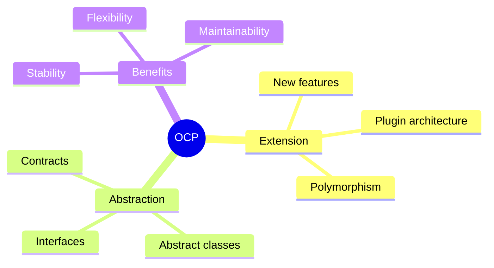
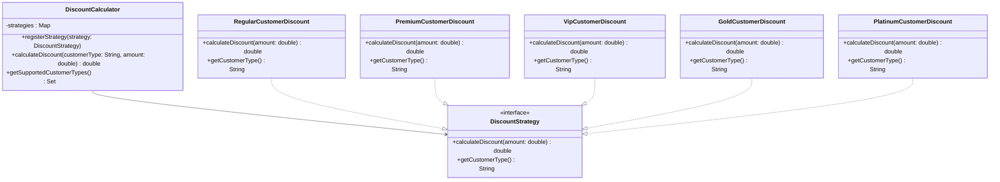

🧑‍💻 **Author:** RK ROY

# Open/Closed Principle (OCP)

## 🎯 Definition

> "Software entities (classes, modules, functions, etc.) should be **open for extension** but **closed for modification**."
>
> _- Bertrand Meyer_

The Open/Closed Principle states that you should be able to **extend the behavior** of a system **without modifying** its existing code. This is achieved through **abstraction** and **polymorphism**.

## 🤔 What Does "Open/Closed" Mean?

- **Open for Extension**: You can add new functionality and behaviors
- **Closed for Modification**: Existing code should not be changed when adding new features

### Key Concepts



## ❌ OCP Violation: Modification Required

Let's look at a classic example that violates OCP:

<CodeTabs :languages="[
{name : 'C++', slot : 'cpp'},
{name : 'Java', slot : 'java'}
]">

<template #java>

```java
// ❌ VIOLATION: Need to modify existing code for new features
public class DiscountCalculator {
    public double calculateDiscount(String customerType, double amount) {
        if (customerType.equals("REGULAR")) {
            return amount * 0.05; // 5% discount
        } else if (customerType.equals("PREMIUM")) {
            return amount * 0.10; // 10% discount
        } else if (customerType.equals("VIP")) {
            return amount * 0.15; // 15% discount
        } else if (customerType.equals("GOLD")) {  // ❌ NEW: Had to modify existing code
            return amount * 0.20; // 20% discount
        } else if (customerType.equals("PLATINUM")) { // ❌ NEW: More modifications
            return amount * 0.25; // 25% discount
        }
        return 0;
    }
}
```

</template>

<template #cpp>

```cpp
#include <iostream>
#include <string>
using namespace std;

// ❌ VIOLATION: Need to modify existing code for new features
class DiscountCalculator {
public:
    double calculateDiscount(const string& customerType, double amount) {
        if (customerType == "REGULAR") {
            return amount * 0.05;
        } else if (customerType == "PREMIUM") {
            return amount * 0.10;
        } else if (customerType == "VIP") {
            return amount * 0.15;
        } else if (customerType == "GOLD") { // ❌ New feature requires modification
            return amount * 0.20;
        } else if (customerType == "PLATINUM") {
            return amount * 0.25;
        }
        return 0;
    }
};
```

</template>
</CodeTabs>

### Problems with This Design

1. **Modification Required**: Every new customer type requires changing existing code
2. **Risk of Bugs**: Modifying existing code can introduce bugs
3. **Violation of Single Responsibility**: The class has to know about all customer types
4. **Hard to Test**: Need to retest all existing functionality when adding new types
5. **Tight Coupling**: Calculator is tightly coupled to specific customer types

## ✅ OCP Solution: Extension Without Modification

Let's refactor using abstraction and polymorphism:

### 1. Create Discount Strategy Interface

<CodeTabs :languages="[
{name : 'C++', slot : 'cpp'},
{name : 'Java', slot : 'java'}
]">

<template #java>

```java
// ✅ GOOD: Abstract interface for discount calculation
public interface DiscountStrategy {
    double calculateDiscount(double amount);
    String getCustomerType();
}
```

</template>

<template #cpp>

```cpp
#include <iostream>
#include <string>
#include <map>
#include <memory>
#include <stdexcept>
#include <set>
using namespace std;

class DiscountStrategy {
public:
    virtual double calculateDiscount(double amount) const = 0;
    virtual string getCustomerType() const = 0;
    virtual ~DiscountStrategy() = default;
};
```

</template>
</CodeTabs>

### 2. Implement Concrete Strategies

<CodeTabs :languages="[
{name : 'C++', slot : 'cpp'},
{name : 'Java', slot : 'java'}
]">

<template #java>

```java
// ✅ GOOD: Regular customer discount strategy
public class RegularCustomerDiscount implements DiscountStrategy {
    @Override
    public double calculateDiscount(double amount) {
        return amount * 0.05; // 5% discount
    }

    @Override
    public String getCustomerType() {
        return "REGULAR";
    }
}

// ✅ GOOD: Premium customer discount strategy
public class PremiumCustomerDiscount implements DiscountStrategy {
    @Override
    public double calculateDiscount(double amount) {
        return amount * 0.10; // 10% discount
    }

    @Override
    public String getCustomerType() {
        return "PREMIUM";
    }
}

// ✅ GOOD: VIP customer discount strategy
public class VipCustomerDiscount implements DiscountStrategy {
    @Override
    public double calculateDiscount(double amount) {
        return amount * 0.15; // 15% discount
    }

    @Override
    public String getCustomerType() {
        return "VIP";
    }
}
```

</template>

<template #cpp>

```cpp
class RegularCustomerDiscount : public DiscountStrategy {
public:
    double calculateDiscount(double amount) const override {
        return amount * 0.05;
    }
    string getCustomerType() const override {
        return "REGULAR";
    }
};

class PremiumCustomerDiscount : public DiscountStrategy {
public:
    double calculateDiscount(double amount) const override {
        return amount * 0.10;
    }
    string getCustomerType() const override {
        return "PREMIUM";
    }
};

class VipCustomerDiscount : public DiscountStrategy {
public:
    double calculateDiscount(double amount) const override {
        return amount * 0.15;
    }
    string getCustomerType() const override {
        return "VIP";
    }
};
```

</template>
</CodeTabs>

### 3. Context Class Using Strategy

<CodeTabs :languages="[
{name : 'C++', slot : 'cpp'},
{name : 'Java', slot : 'java'}
]">

<template #java>

```java
// ✅ GOOD: Calculator that works with any discount strategy
public class DiscountCalculator {
    private Map<String, DiscountStrategy> strategies;

    public DiscountCalculator() {
        this.strategies = new HashMap<>();
        // Register default strategies
        registerStrategy(new RegularCustomerDiscount());
        registerStrategy(new PremiumCustomerDiscount());
        registerStrategy(new VipCustomerDiscount());
    }

    public void registerStrategy(DiscountStrategy strategy) {
        strategies.put(strategy.getCustomerType(), strategy);
    }

    public double calculateDiscount(String customerType, double amount) {
        DiscountStrategy strategy = strategies.get(customerType);
        if (strategy == null) {
            throw new IllegalArgumentException("Unknown customer type: " + customerType);
        }
        return strategy.calculateDiscount(amount);
    }

    public Set<String> getSupportedCustomerTypes() {
        return strategies.keySet();
    }
}
```

</template>

<template #cpp>

```cpp
class DiscountCalculator {
    map<string, unique_ptr<DiscountStrategy>> strategies;
public:
    DiscountCalculator() {
        registerStrategy(make_unique<RegularCustomerDiscount>());
        registerStrategy(make_unique<PremiumCustomerDiscount>());
        registerStrategy(make_unique<VipCustomerDiscount>());
    }

    void registerStrategy(unique_ptr<DiscountStrategy> strategy) {
        string key = strategy->getCustomerType();
        strategies[key] = move(strategy);
    }

    double calculateDiscount(const string& customerType, double amount) const {
        auto it = strategies.find(customerType);
        if (it == strategies.end()) {
            throw invalid_argument("Unknown customer type: " + customerType);
        }
        return it->second->calculateDiscount(amount);
    }

    set<string> getSupportedCustomerTypes() const {
        set<string> keys;
        for (auto& kv : strategies)
            keys.insert(kv.first);
        return keys;
    }
};
```

</template>

</CodeTabs>

## 🚀 Adding New Features Without Modification

Now we can add new customer types **without modifying existing code**:

<CodeTabs :languages="[
{name : 'C++', slot : 'cpp'},
{name : 'Java', slot : 'java'}
]">

<template #java>

```java
// ✅ NEW: Gold customer discount - NO modification to existing code needed!
public class GoldCustomerDiscount implements DiscountStrategy {
    @Override
    public double calculateDiscount(double amount) {
        return amount * 0.20; // 20% discount
    }

    @Override
    public String getCustomerType() {
        return "GOLD";
    }
}

// ✅ NEW: Platinum customer with complex logic - still no modification needed!
public class PlatinumCustomerDiscount implements DiscountStrategy {
    @Override
    public double calculateDiscount(double amount) {
        // Complex discount logic
        if (amount > 10000) {
            return amount * 0.30; // 30% for large purchases
        } else if (amount > 5000) {
            return amount * 0.25; // 25% for medium purchases
        }
        return amount * 0.20; // 20% base discount
    }

    @Override
    public String getCustomerType() {
        return "PLATINUM";
    }
}

// ✅ NEW: Corporate customer with seasonal promotions
public class CorporateCustomerDiscount implements DiscountStrategy {
    private boolean isHolidaySeason;

    public CorporateCustomerDiscount(boolean isHolidaySeason) {
        this.isHolidaySeason = isHolidaySeason;
    }

    @Override
    public double calculateDiscount(double amount) {
        double baseDiscount = amount * 0.18; // 18% base
        return isHolidaySeason ? baseDiscount * 1.5 : baseDiscount;
    }

    @Override
    public String getCustomerType() {
        return "CORPORATE";
    }
}
```

</template>

<template #cpp>

```cpp
class GoldCustomerDiscount : public DiscountStrategy {
public:
    double calculateDiscount(double amount) const override {
        return amount * 0.20;
    }
    string getCustomerType() const override {
        return "GOLD";
    }
};

class PlatinumCustomerDiscount : public DiscountStrategy {
public:
    double calculateDiscount(double amount) const override {
        if (amount > 10000) return amount * 0.30;
        else if (amount > 5000) return amount * 0.25;
        return amount * 0.20;
    }
    string getCustomerType() const override {
        return "PLATINUM";
    }
};

class CorporateCustomerDiscount : public DiscountStrategy {
    bool isHolidaySeason;
public:
    CorporateCustomerDiscount(bool isHoliday) : isHolidaySeason(isHoliday) {}
    double calculateDiscount(double amount) const override {
        double base = amount * 0.18;
        return isHolidaySeason ? base * 1.5 : base;
    }
    string getCustomerType() const override {
        return "CORPORATE";
    }
};
```

</template>

</CodeTabs>

## 🏗️ Class Diagram After OCP



## 🎯 Using the OCP Solution

<CodeTabs :languages="[
{name : 'C++', slot : 'cpp'},
{name : 'Java', slot : 'java'}
]">

<template #java>

```java
public class ECommerceSystem {
    public static void main(String[] args) {
        DiscountCalculator calculator = new DiscountCalculator();

        // Add new strategies without modifying existing code
        calculator.registerStrategy(new GoldCustomerDiscount());
        calculator.registerStrategy(new PlatinumCustomerDiscount());
        calculator.registerStrategy(new CorporateCustomerDiscount(true)); // Holiday season

        // Use the calculator
        double amount = 1000.0;

        System.out.println("Regular: $" + calculator.calculateDiscount("REGULAR", amount));
        System.out.println("Premium: $" + calculator.calculateDiscount("PREMIUM", amount));
        System.out.println("VIP: $" + calculator.calculateDiscount("VIP", amount));
        System.out.println("Gold: $" + calculator.calculateDiscount("GOLD", amount));
        System.out.println("Platinum: $" + calculator.calculateDiscount("PLATINUM", amount));
        System.out.println("Corporate: $" + calculator.calculateDiscount("CORPORATE", amount));

        System.out.println("\nSupported customer types: " + calculator.getSupportedCustomerTypes());
    }
}
```

</template>

<template #cpp>

```cpp
int main() {
    DiscountCalculator calculator;

    calculator.registerStrategy(make_unique<GoldCustomerDiscount>());
    calculator.registerStrategy(make_unique<PlatinumCustomerDiscount>());
    calculator.registerStrategy(make_unique<CorporateCustomerDiscount>(true));

    double amount = 1000.0;

    cout << "Regular: $" << calculator.calculateDiscount("REGULAR", amount) << endl;
    cout << "Premium: $" << calculator.calculateDiscount("PREMIUM", amount) << endl;
    cout << "VIP: $" << calculator.calculateDiscount("VIP", amount) << endl;
    cout << "Gold: $" << calculator.calculateDiscount("GOLD", amount) << endl;
    cout << "Platinum: $" << calculator.calculateDiscount("PLATINUM", amount) << endl;
    cout << "Corporate: $" << calculator.calculateDiscount("CORPORATE", amount) << endl;

    cout << "\nSupported customer types: ";
    for (auto& type : calculator.getSupportedCustomerTypes())
        cout << type << " ";
    cout << endl;
}
```

</template>
</CodeTabs>

## 🎨 More OCP Examples

### Example 1: Shape Area Calculator

#### ❌ Violation

<CodeTabs :languages="[
{name : 'C++', slot : 'cpp'},
{name : 'Java', slot : 'java'}
]">

<template #java>

```java
public class AreaCalculator {
    public double calculateArea(Object shape) {
        if (shape instanceof Circle) {
            Circle circle = (Circle) shape;
            return Math.PI * circle.getRadius() * circle.getRadius();
        } else if (shape instanceof Rectangle) {
            Rectangle rectangle = (Rectangle) shape;
            return rectangle.getWidth() * rectangle.getHeight();
        } else if (shape instanceof Triangle) { // ❌ NEW: Had to modify
            Triangle triangle = (Triangle) shape;
            return 0.5 * triangle.getBase() * triangle.getHeight();
        }
        return 0;
    }
}
```

</template>

<template #cpp>

```cpp
#include <typeinfo>
#include <cmath>

class Circle { public: double r; Circle(double radius): r(radius) {} };
class Rectangle { public: double w, h; Rectangle(double w_, double h_): w(w_), h(h_) {} };
class Triangle { public: double b, h; Triangle(double b_, double h_): b(b_), h(h_) {} };

class AreaCalculator {
public:
    double calculateArea(const Circle& c) { return M_PI * c.r * c.r; }
    double calculateArea(const Rectangle& r) { return r.w * r.h; }
    double calculateArea(const Triangle& t) { return 0.5 * t.b * t.h; } // ❌ New code modification
};
```

</template>

</CodeTabs>

#### ✅ Solution

<CodeTabs :languages="[
{name : 'C++', slot : 'cpp'},
{name : 'Java', slot : 'java'}
]">

<template #java>

```java
// Abstract shape interface
public interface Shape {
    double calculateArea();
}

// Concrete implementations
public class Circle implements Shape {
    private double radius;

    public Circle(double radius) { this.radius = radius; }

    @Override
    public double calculateArea() {
        return Math.PI * radius * radius;
    }
}

public class Rectangle implements Shape {
    private double width, height;

    public Rectangle(double width, double height) {
        this.width = width;
        this.height = height;
    }

    @Override
    public double calculateArea() {
        return width * height;
    }
}

// ✅ NEW: Can add new shapes without modifying existing code
public class Triangle implements Shape {
    private double base, height;

    public Triangle(double base, double height) {
        this.base = base;
        this.height = height;
    }

    @Override
    public double calculateArea() {
        return 0.5 * base * height;
    }
}

// Calculator that works with any shape
public class AreaCalculator {
    public double calculateTotalArea(List<Shape> shapes) {
        return shapes.stream()
                    .mapToDouble(Shape::calculateArea)
                    .sum();
    }
}
```

</template>

<template #cpp>

```cpp
class Shape {
public:
    virtual double calculateArea() const = 0;
    virtual ~Shape() = default;
};

class CircleShape : public Shape {
    double radius;
public:
    CircleShape(double r): radius(r) {}
    double calculateArea() const override { return M_PI * radius * radius; }
};

class RectangleShape : public Shape {
    double width, height;
public:
    RectangleShape(double w, double h): width(w), height(h) {}
    double calculateArea() const override { return width * height; }
};

class TriangleShape : public Shape {
    double base, height;
public:
    TriangleShape(double b, double h): base(b), height(h) {}
    double calculateArea() const override { return 0.5 * base * height; }
};

#include <vector>
#include <numeric>

class AreaCalculator {
public:
    double calculateTotalArea(const vector<unique_ptr<Shape>>& shapes) const {
        double total = 0;
        for (auto& s : shapes) total += s->calculateArea();
        return total;
    }
};
```

</template>

</CodeTabs>

### Example 2: Payment Processing

#### ❌ Violation

<CodeTabs :languages="[
{name : 'C++', slot : 'cpp'},
{name : 'Java', slot : 'java'}
]">

<template #java>

```java
public class PaymentProcessor {
    public void processPayment(String paymentType, double amount) {
        if (paymentType.equals("CREDIT_CARD")) {
            // Credit card processing logic
            System.out.println("Processing credit card payment: $" + amount);
        } else if (paymentType.equals("PAYPAL")) {
            // PayPal processing logic
            System.out.println("Processing PayPal payment: $" + amount);
        } else if (paymentType.equals("CRYPTO")) { // ❌ NEW: Modification required
            // Cryptocurrency processing logic
            System.out.println("Processing crypto payment: $" + amount);
        }
    }
}
```

</template>

<template #cpp>

```cpp
#include <iostream>
#include <string>
using namespace std;

class PaymentProcessor {
public:
    void processPayment(const string& paymentType, double amount) {
        if (paymentType == "CREDIT_CARD") {
            // Credit card processing logic
            cout << "Processing credit card payment: $" << amount << '\n';
        } else if (paymentType == "PAYPAL") {
            // PayPal processing logic
            cout << "Processing PayPal payment: $" << amount << '\n';
        } else if (paymentType == "CRYPTO") { // ❌ NEW: Modification required
            // Cryptocurrency processing logic
            cout << "Processing crypto payment: $" << amount << '\n';
        }
    }
};

int main() {
    PaymentProcessor p;
    p.processPayment("CREDIT_CARD", 100.0);
    p.processPayment("PAYPAL", 200.0);
    p.processPayment("CRYPTO", 300.0);
}
```

</template>

</CodeTabs>

#### ✅ Solution

<CodeTabs :languages="[
{name : 'C++', slot : 'cpp'},
{name : 'Java', slot : 'java'}
]">

<template #java>

```java
// Payment strategy interface
public interface PaymentStrategy {
    void processPayment(double amount);
    String getPaymentType();
    boolean isAvailable();
}

// Concrete payment strategies
public class CreditCardPayment implements PaymentStrategy {
    private String cardNumber;
    private String expiryDate;

    public CreditCardPayment(String cardNumber, String expiryDate) {
        this.cardNumber = cardNumber;
        this.expiryDate = expiryDate;
    }

    @Override
    public void processPayment(double amount) {
        // Credit card processing logic
        System.out.println("Processing credit card payment: $" + amount);
        System.out.println("Card ending in: " + cardNumber.substring(cardNumber.length() - 4));
    }

    @Override
    public String getPaymentType() { return "CREDIT_CARD"; }

    @Override
    public boolean isAvailable() {
        // Check if card is valid and not expired
        return true;
    }
}

public class PayPalPayment implements PaymentStrategy {
    private String email;

    public PayPalPayment(String email) { this.email = email; }

    @Override
    public void processPayment(double amount) {
        System.out.println("Processing PayPal payment: $" + amount);
        System.out.println("PayPal account: " + email);
    }

    @Override
    public String getPaymentType() { return "PAYPAL"; }

    @Override
    public boolean isAvailable() { return true; }
}

// ✅ NEW: Can add new payment methods without modifying existing code
public class CryptocurrencyPayment implements PaymentStrategy {
    private String walletAddress;
    private String coinType;

    public CryptocurrencyPayment(String walletAddress, String coinType) {
        this.walletAddress = walletAddress;
        this.coinType = coinType;
    }

    @Override
    public void processPayment(double amount) {
        System.out.println("Processing " + coinType + " payment: $" + amount);
        System.out.println("Wallet: " + walletAddress);
    }

    @Override
    public String getPaymentType() { return "CRYPTOCURRENCY"; }

    @Override
    public boolean isAvailable() {
        // Check blockchain network status
        return true;
    }
}

// Payment processor using strategies
public class PaymentProcessor {
    private Map<String, PaymentStrategy> strategies;

    public PaymentProcessor() {
        this.strategies = new HashMap<>();
    }

    public void registerPaymentMethod(PaymentStrategy strategy) {
        strategies.put(strategy.getPaymentType(), strategy);
    }

    public void processPayment(String paymentType, double amount) {
        PaymentStrategy strategy = strategies.get(paymentType);
        if (strategy == null) {
            throw new IllegalArgumentException("Unsupported payment type: " + paymentType);
        }

        if (!strategy.isAvailable()) {
            throw new RuntimeException("Payment method not available: " + paymentType);
        }

        strategy.processPayment(amount);
    }

    public List<String> getAvailablePaymentMethods() {
        return strategies.values().stream()
                        .filter(PaymentStrategy::isAvailable)
                        .map(PaymentStrategy::getPaymentType)
                        .collect(Collectors.toList());
    }
}
```

</template>

<template #cpp>

```cpp
#include <iostream>
#include <vector>
#include <map>
#include <memory>
#include <algorithm>

class PaymentStrategy {
public:
    virtual void processPayment(double amount) const = 0;
    virtual string getPaymentType() const = 0;
    virtual bool isAvailable() const = 0;
    virtual ~PaymentStrategy() = default;
};

class CreditCardPayment : public PaymentStrategy {
    string cardNumber, expiry;
public:
    CreditCardPayment(string c, string e): cardNumber(c), expiry(e) {}
    void processPayment(double amount) const override {
        cout << "Processing credit card payment: $" << amount << endl;
        cout << "Card ending: " << cardNumber.substr(cardNumber.size() - 4) << endl;
    }
    string getPaymentType() const override { return "CREDIT_CARD"; }
    bool isAvailable() const override { return true; }
};

class PayPalPayment : public PaymentStrategy {
    string email;
public:
    PayPalPayment(string e): email(e) {}
    void processPayment(double amount) const override {
        cout << "Processing PayPal payment: $" << amount << endl;
        cout << "Account: " << email << endl;
    }
    string getPaymentType() const override { return "PAYPAL"; }
    bool isAvailable() const override { return true; }
};

class CryptoPayment : public PaymentStrategy {
    string wallet, coin;
public:
    CryptoPayment(string w, string c): wallet(w), coin(c) {}
    void processPayment(double amount) const override {
        cout << "Processing " << coin << " payment: $" << amount << endl;
        cout << "Wallet: " << wallet << endl;
    }
    string getPaymentType() const override { return "CRYPTO"; }
    bool isAvailable() const override { return true; }
};

class PaymentProcessor {
    map<string, unique_ptr<PaymentStrategy>> methods;
public:
    void registerPayment(unique_ptr<PaymentStrategy> method) {
        methods[method->getPaymentType()] = move(method);
    }

    void processPayment(const string& type, double amount) {
        auto it = methods.find(type);
        if (it == methods.end()) throw invalid_argument("Unsupported payment type: " + type);
        if (!it->second->isAvailable()) throw runtime_error("Payment method not available");
        it->second->processPayment(amount);
    }

    vector<string> getAvailableMethods() const {
        vector<string> result;
        for (auto& m : methods)
            if (m.second->isAvailable()) result.push_back(m.first);
        return result;
    }
};
```

</template>

</CodeTabs>

## 🛠️ OCP Implementation Patterns

### 1. Strategy Pattern

<CodeTabs :languages="[
{name : 'C++', slot : 'cpp'},
{name : 'Java', slot : 'java'}
]">

<template #java>

```java
// Context class that uses strategies
public class TextFormatter {
    private FormattingStrategy strategy;

    public void setFormattingStrategy(FormattingStrategy strategy) {
        this.strategy = strategy;
    }

    public String format(String text) {
        return strategy.format(text);
    }
}

// Strategy interface
public interface FormattingStrategy {
    String format(String text);
}

// Concrete strategies - can add more without modifying existing code
public class UpperCaseFormatter implements FormattingStrategy {
    public String format(String text) { return text.toUpperCase(); }
}

public class LowerCaseFormatter implements FormattingStrategy {
    public String format(String text) { return text.toLowerCase(); }
}
```

</template>

<template #cpp>

```cpp
#include <iostream>
#include <string>
#include <memory>
#include <algorithm>
using namespace std;

// Strategy interface
class FormattingStrategy {
public:
    virtual string format(const string& text) const = 0;
    virtual ~FormattingStrategy() = default;
};

// Concrete strategy — UpperCase
class UpperCaseFormatter : public FormattingStrategy {
public:
    string format(const string& text) const override {
        string result = text;
        transform(result.begin(), result.end(), result.begin(), ::toupper);
        return result;
    }
};

// Concrete strategy — LowerCase
class LowerCaseFormatter : public FormattingStrategy {
public:
    string format(const string& text) const override {
        string result = text;
        transform(result.begin(), result.end(), result.begin(), ::tolower);
        return result;
    }
};

// Context class that uses strategies
class TextFormatter {
    unique_ptr<FormattingStrategy> strategy;
public:
    void setFormattingStrategy(unique_ptr<FormattingStrategy> s) {
        strategy = move(s);
    }

    string format(const string& text) const {
        if (!strategy) throw runtime_error("No formatting strategy set!");
        return strategy->format(text);
    }
};

// Example usage
int main() {
    TextFormatter formatter;

    formatter.setFormattingStrategy(make_unique<UpperCaseFormatter>());
    cout << "Upper: " << formatter.format("Open Closed Principle") << endl;

    formatter.setFormattingStrategy(make_unique<LowerCaseFormatter>());
    cout << "Lower: " << formatter.format("Open Closed Principle") << endl;
}
```

</template>

</CodeTabs>

### 2. Template Method Pattern

<CodeTabs :languages="[
{name : 'C++', slot : 'cpp'},
{name : 'Java', slot : 'java'}
]">

<template #java>

```java
// Abstract base class defining the algorithm template
public abstract class DataProcessor {

    // Template method - defines the algorithm structure
    public final void processData(String data) {
        String cleanedData = cleanData(data);
        String validatedData = validateData(cleanedData);
        String transformedData = transformData(validatedData);
        saveData(transformedData);
    }

    // Steps that can be extended by subclasses
    protected abstract String cleanData(String data);
    protected abstract String validateData(String data);
    protected abstract String transformData(String data);
    protected abstract void saveData(String data);
}

// ✅ NEW: Can add new processors without modifying base class
public class CSVDataProcessor extends DataProcessor {
    protected String cleanData(String data) { /* CSV-specific cleaning */ return data; }
    protected String validateData(String data) { /* CSV validation */ return data; }
    protected String transformData(String data) { /* CSV transformation */ return data; }
    protected void saveData(String data) { /* Save CSV */ }
}

public class JSONDataProcessor extends DataProcessor {
    protected String cleanData(String data) { /* JSON-specific cleaning */ return data; }
    protected String validateData(String data) { /* JSON validation */ return data; }
    protected String transformData(String data) { /* JSON transformation */ return data; }
    protected void saveData(String data) { /* Save JSON */ }
}
```

</template>

<template #cpp>

```cpp
#include <iostream>
#include <string>
using namespace std;

// Abstract base class defining the algorithm template
class DataProcessor {
public:
    // Template method - defines the algorithm structure
    void processData(const string& data) final {
        string cleanedData = cleanData(data);
        string validatedData = validateData(cleanedData);
        string transformedData = transformData(validatedData);
        saveData(transformedData);
    }

protected:
    // Steps to be implemented by subclasses
    virtual string cleanData(const string& data) = 0;
    virtual string validateData(const string& data) = 0;
    virtual string transformData(const string& data) = 0;
    virtual void saveData(const string& data) = 0;

    virtual ~DataProcessor() = default;
};

// ✅ NEW: CSVDataProcessor subclass
class CSVDataProcessor : public DataProcessor {
protected:
    string cleanData(const string& data) override {
        cout << "Cleaning CSV data...\n";
        return data;
    }

    string validateData(const string& data) override {
        cout << "Validating CSV data...\n";
        return data;
    }

    string transformData(const string& data) override {
        cout << "Transforming CSV data...\n";
        return data;
    }

    void saveData(const string& data) override {
        cout << "Saving CSV data...\n";
    }
};

// ✅ NEW: JSONDataProcessor subclass
class JSONDataProcessor : public DataProcessor {
protected:
    string cleanData(const string& data) override {
        cout << "Cleaning JSON data...\n";
        return data;
    }

    string validateData(const string& data) override {
        cout << "Validating JSON data...\n";
        return data;
    }

    string transformData(const string& data) override {
        cout << "Transforming JSON data...\n";
        return data;
    }

    void saveData(const string& data) override {
        cout << "Saving JSON data...\n";
    }
};

// Example usage
int main() {
    CSVDataProcessor csvProcessor;
    JSONDataProcessor jsonProcessor;

    cout << "---- Processing CSV ----\n";
    csvProcessor.processData("CSV sample data");

    cout << "\n---- Processing JSON ----\n";
    jsonProcessor.processData("JSON sample data");
}
```

</template>

</CodeTabs>

### 3. Plugin Architecture

<CodeTabs :languages="[
{name : 'C++', slot : 'cpp'},
{name : 'Java', slot : 'java'}
]">

<template #java>

```java
// Plugin interface
public interface Plugin {
    String getName();
    String getVersion();
    void execute();
    boolean isEnabled();
}

// Plugin manager
public class PluginManager {
    private List<Plugin> plugins = new ArrayList<>();

    public void registerPlugin(Plugin plugin) {
        plugins.add(plugin);
        System.out.println("Registered plugin: " + plugin.getName());
    }

    public void executePlugins() {
        plugins.stream()
               .filter(Plugin::isEnabled)
               .forEach(Plugin::execute);
    }

    public List<Plugin> getPlugins() {
        return new ArrayList<>(plugins);
    }
}

// ✅ NEW: Can add new plugins without modifying plugin manager
public class BackupPlugin implements Plugin {
    public String getName() { return "Backup Plugin"; }
    public String getVersion() { return "1.0"; }
    public boolean isEnabled() { return true; }
    public void execute() { System.out.println("Running backup..."); }
}

public class SecurityScanPlugin implements Plugin {
    public String getName() { return "Security Scanner"; }
    public String getVersion() { return "2.1"; }
    public boolean isEnabled() { return true; }
    public void execute() { System.out.println("Running security scan..."); }
}
```

</template>

<template #cpp>

```cpp
#include <iostream>
#include <string>
#include <vector>
#include <memory>
#include <algorithm>
using namespace std;

// Plugin interface
class Plugin {
public:
    virtual string getName() const = 0;
    virtual string getVersion() const = 0;
    virtual void execute() const = 0;
    virtual bool isEnabled() const = 0;
    virtual ~Plugin() = default;
};

// Plugin Manager
class PluginManager {
    vector<unique_ptr<Plugin>> plugins;

public:
    void registerPlugin(unique_ptr<Plugin> plugin) {
        cout << "Registered plugin: " << plugin->getName() << endl;
        plugins.push_back(move(plugin));
    }

    void executePlugins() const {
        for (const auto& plugin : plugins) {
            if (plugin->isEnabled()) {
                plugin->execute();
            }
        }
    }

    vector<const Plugin*> getPlugins() const {
        vector<const Plugin*> list;
        for (const auto& p : plugins) list.push_back(p.get());
        return list;
    }
};

// ✅ NEW: Backup Plugin (no modification to manager)
class BackupPlugin : public Plugin {
public:
    string getName() const override { return "Backup Plugin"; }
    string getVersion() const override { return "1.0"; }
    bool isEnabled() const override { return true; }
    void execute() const override { cout << "Running backup..." << endl; }
};

// ✅ NEW: Security Scan Plugin (no modification to manager)
class SecurityScanPlugin : public Plugin {
public:
    string getName() const override { return "Security Scanner"; }
    string getVersion() const override { return "2.1"; }
    bool isEnabled() const override { return true; }
    void execute() const override { cout << "Running security scan..." << endl; }
};

// Example usage
int main() {
    PluginManager manager;

    manager.registerPlugin(make_unique<BackupPlugin>());
    manager.registerPlugin(make_unique<SecurityScanPlugin>());

    cout << "\nExecuting enabled plugins:\n";
    manager.executePlugins();

    cout << "\nLoaded Plugins:\n";
    for (const Plugin* p : manager.getPlugins()) {
        cout << "- " << p->getName() << " v" << p->getVersion() << endl;
    }

    return 0;
}
```

</template>

</CodeTabs>

## 🔍 How to Identify OCP Violations

### Questions to Ask

1. **Do I need to modify existing classes when adding new features?**
2. **Are there multiple if/else or switch statements based on types?**
3. **Is the class tightly coupled to specific implementations?**
4. **Do I need to recompile and retest existing code for new features?**

### Warning Signs

- ❌ Long if/else chains or switch statements
- ❌ Frequent modifications to the same classes
- ❌ Hard-coded dependencies
- ❌ Classes that need to "know" about all possible implementations
- ❌ Difficulty adding new features without extensive changes

## 🎯 Benefits of Following OCP

### 1. **Stability**

<CodeTabs :languages="[
{name : 'C++', slot : 'cpp'},
{name : 'Java', slot : 'java'}
]">

<template #java>

```java
// ✅ Existing code remains stable when adding new features
public class Logger {
    private List<LogHandler> handlers = new ArrayList<>();

    public void addHandler(LogHandler handler) {
        handlers.add(handler);  // No modification to existing code
    }

    public void log(String message) {
        handlers.forEach(handler -> handler.handle(message));
    }
}

// ✅ NEW: Add new handlers without touching Logger class
public class SlackLogHandler implements LogHandler {
    public void handle(String message) {
        // Send to Slack
    }
}
```

</template>

<template #cpp>

```cpp
#include <iostream>
#include <string>
#include <vector>
#include <memory>
using namespace std;

// LogHandler interface
class LogHandler {
public:
    virtual void handle(const string& message) const = 0;
    virtual ~LogHandler() = default;
};

// ✅ Existing Logger class — open for extension, closed for modification
class Logger {
    vector<unique_ptr<LogHandler>> handlers;

public:
    void addHandler(unique_ptr<LogHandler> handler) {
        handlers.push_back(move(handler));  // No modification to add new handlers
    }

    void log(const string& message) const {
        for (const auto& handler : handlers) {
            handler->handle(message);
        }
    }
};

// ✅ NEW: Console log handler
class ConsoleLogHandler : public LogHandler {
public:
    void handle(const string& message) const override {
        cout << "[Console] " << message << endl;
    }
};

// ✅ NEW: File log handler
class FileLogHandler : public LogHandler {
public:
    void handle(const string& message) const override {
        // Example simulation (in real-world, you'd write to a file)
        cout << "[File] Logging message to file: " << message << endl;
    }
};

// ✅ NEW: Slack log handler — no modification to Logger class
class SlackLogHandler : public LogHandler {
public:
    void handle(const string& message) const override {
        // Simulate sending message to Slack
        cout << "[Slack] Sending to Slack channel: " << message << endl;
    }
};

// Example usage
int main() {
    Logger logger;

    logger.addHandler(make_unique<ConsoleLogHandler>());
    logger.addHandler(make_unique<FileLogHandler>());
    logger.addHandler(make_unique<SlackLogHandler>()); // Added new handler without changing Logger

    logger.log("System started successfully!");
    logger.log("User logged in!");
}
```

</template>

</CodeTabs>

### 2. **Easier Testing**

```java
@Test
public void testNewDiscountStrategy() {
    // Test only the new strategy, existing code unaffected
    DiscountStrategy strategy = new StudentDiscountStrategy();
    double discount = strategy.calculateDiscount(100.0);
    assertEquals(15.0, discount, 0.01);
}
```

### 3. **Parallel Development**

```java
// Team A can work on new payment methods
public class ApplePayPayment implements PaymentStrategy {
    // Implementation
}

// Team B can work on new shipping methods
public class DroneShipping implements ShippingStrategy {
    // Implementation
}

// Neither team affects the other's work
```

## 🚨 Common OCP Mistakes

### ❌ Over-Engineering

Don't create abstractions prematurely:

```java
// ❌ BAD: Creating unnecessary abstraction
public interface NumberProcessor {
    int process(int number);
}

public class AddOneProcessor implements NumberProcessor {
    public int process(int number) { return number + 1; }
}

// ✅ BETTER: Simple method until extension is actually needed
public class Calculator {
    public int addOne(int number) { return number + 1; }
}
```

### ❌ Wrong Abstraction Level

```java
// ❌ BAD: Too specific interface
public interface DatabaseUserRepository {
    void saveUserToMySQL(User user);
    void saveUserToPostgreSQL(User user);
}

// ✅ BETTER: Proper abstraction level
public interface UserRepository {
    void save(User user);
    User findById(Long id);
}
```

## 🛠️ Refactoring to OCP

### Step-by-Step Process

1. **Identify Variation Points**: Find code that changes frequently
2. **Extract Abstractions**: Create interfaces or abstract classes
3. **Implement Strategies**: Create concrete implementations
4. **Use Dependency Injection**: Inject dependencies instead of creating them
5. **Register/Configure**: Use configuration or registration mechanisms

### Example Refactoring

<CodeTabs :languages="[
{name : 'C++', slot : 'cpp'},
{name : 'Java', slot : 'java'}
]">

<template #java>

```java
// BEFORE: Violation
public class ReportGenerator {
    public void generateReport(String type, List<Data> data) {
        if (type.equals("PDF")) {
            // Generate PDF
        } else if (type.equals("Excel")) {
            // Generate Excel
        }
    }
}

// AFTER: Following OCP
public interface ReportFormat {
    void generate(List<Data> data, OutputStream output);
}

public class ReportGenerator {
    private Map<String, ReportFormat> formats = new HashMap<>();

    public void registerFormat(String type, ReportFormat format) {
        formats.put(type, format);
    }

    public void generateReport(String type, List<Data> data, OutputStream output) {
        ReportFormat format = formats.get(type);
        if (format != null) {
            format.generate(data, output);
        }
    }
}
```

</template>

<template #cpp>

```cpp
#include <iostream>
#include <string>
#include <vector>
using namespace std;

struct Data {
    string content;
};

// ❌ Violation: New formats require modifying this class
class ReportGenerator {
public:
    void generateReport(const string& type, const vector<Data>& data) {
        if (type == "PDF") {
            cout << "Generating PDF report..." << endl;
            // Generate PDF logic
        } else if (type == "Excel") {
            cout << "Generating Excel report..." << endl;
            // Generate Excel logic
        }
        // ❌ Adding CSV or HTML would require editing this class again
    }
};

int main() {
    ReportGenerator generator;
    vector<Data> dataset = {{"Sample Data 1"}, {"Sample Data 2"}};
    generator.generateReport("PDF", dataset);
    generator.generateReport("Excel", dataset);
}
```

</template>

</CodeTabs>

## 🎓 Practice Exercise

### Exercise: Refactor the Notification System

Here's a system that violates OCP. Can you refactor it?

<CodeTabs :languages="[
{name : 'C++', slot : 'cpp'},
{name : 'Java', slot : 'java'}
]">

<template #java>

```java
public class NotificationService {
    public void sendNotification(String type, String message, String recipient) {
        if (type.equals("EMAIL")) {
            // Send email
            System.out.println("Email sent to " + recipient + ": " + message);
        } else if (type.equals("SMS")) {
            // Send SMS
            System.out.println("SMS sent to " + recipient + ": " + message);
        } else if (type.equals("PUSH")) {
            // Send push notification
            System.out.println("Push notification sent to " + recipient + ": " + message);
        }
    }

    public boolean isValidRecipient(String type, String recipient) {
        if (type.equals("EMAIL")) {
            return recipient.contains("@");
        } else if (type.equals("SMS")) {
            return recipient.matches("\\d{10}");
        } else if (type.equals("PUSH")) {
            return recipient.length() > 0;
        }
        return false;
    }
}
```

</template>

<template #cpp>

```cpp
#include <iostream>
#include <string>
#include <regex>
using namespace std;

class NotificationService {
public:
    void sendNotification(const string& type, const string& message, const string& recipient) {
        if (type == "EMAIL") {
            // Send email
            cout << "Email sent to " << recipient << ": " << message << endl;
        } else if (type == "SMS") {
            // Send SMS
            cout << "SMS sent to " << recipient << ": " << message << endl;
        } else if (type == "PUSH") {
            // Send push notification
            cout << "Push notification sent to " << recipient << ": " << message << endl;
        }
    }

    bool isValidRecipient(const string& type, const string& recipient) {
        if (type == "EMAIL") {
            return recipient.find('@') != string::npos;
        } else if (type == "SMS") {
            // Check if it's exactly 10 digits
            return regex_match(recipient, regex("\\d{10}"));
        } else if (type == "PUSH") {
            return !recipient.empty();
        }
        return false;
    }
};

int main() {
    NotificationService notifier;

    string email = "rkroy@example.com";
    string phone = "9876543210";
    string device = "UserDevice123";

    if (notifier.isValidRecipient("EMAIL", email))
        notifier.sendNotification("EMAIL", "Welcome to our platform!", email);

    if (notifier.isValidRecipient("SMS", phone))
        notifier.sendNotification("SMS", "Your OTP is 1234", phone);

    if (notifier.isValidRecipient("PUSH", device))
        notifier.sendNotification("PUSH", "You have a new message!", device);
}
```

</template>

</CodeTabs>

### Solution Approach

1. Create `NotificationChannel` interface
2. Implement `EmailNotification`, `SMSNotification`, `PushNotification`
3. Create `NotificationService` that uses strategies
4. Add registration mechanism for new notification types

## 📚 Summary

The Open/Closed Principle is about designing software that can **grow and evolve without breaking existing functionality**. By following OCP:

- ✅ **Stability**: Existing code remains unchanged and stable
- ✅ **Extensibility**: New features can be added easily
- ✅ **Maintainability**: Reduced risk of introducing bugs
- ✅ **Testability**: New features can be tested in isolation
- ✅ **Flexibility**: System adapts to changing requirements

Remember: **Open for Extension, Closed for Modification!**

The key is to identify the parts of your system that are likely to change and abstract them behind stable interfaces. Use design patterns like Strategy, Template Method, and Plugin architectures to achieve OCP compliance.

---
